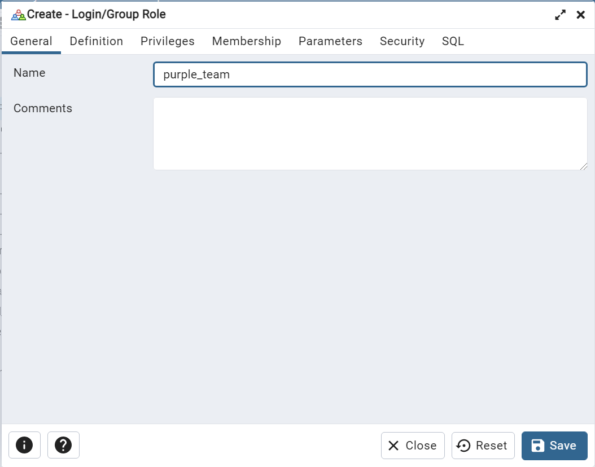
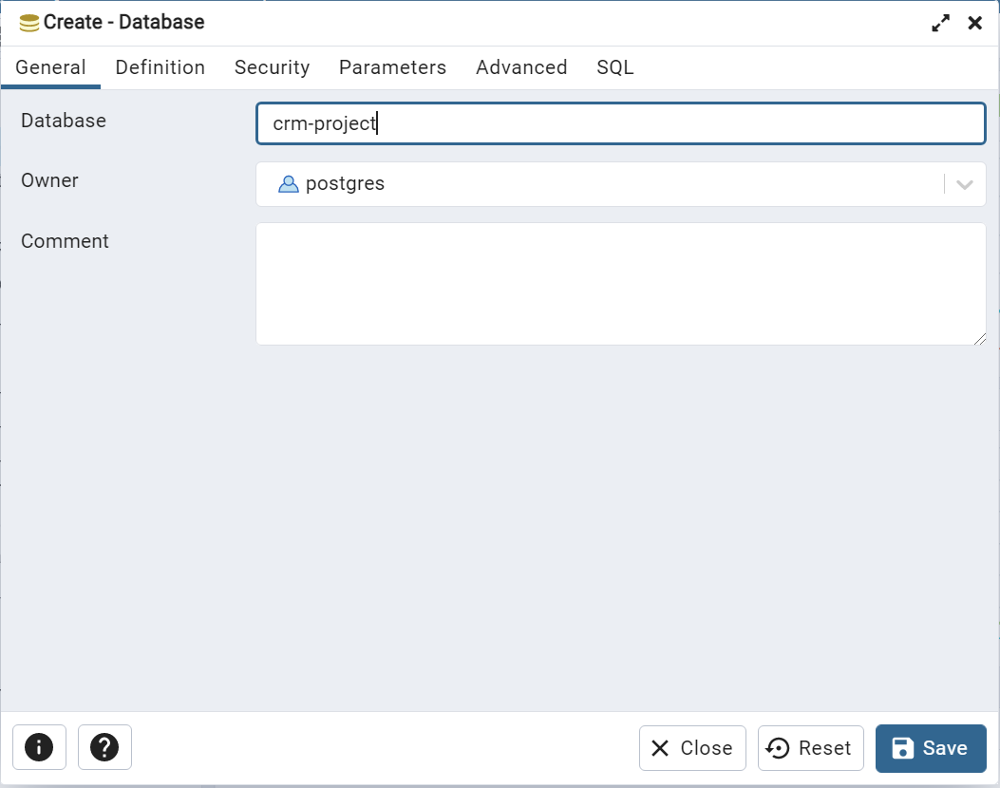
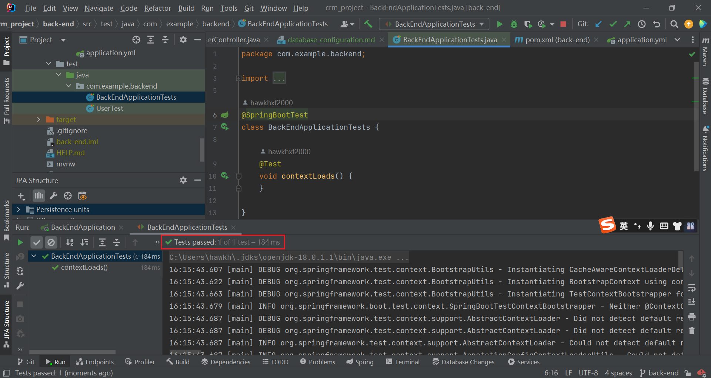

# Test Database Configuration(postgresql)

1. ### Create user(username: purple_team, password: crmproject)

2. ### Create database(database name: crm-project)

3. ### import dependency of postgresql driver
~~~xml
<!--pom.xml-->
<dependency>
    <groupId>org.postgresql</groupId>
    <artifactId>postgresql</artifactId>
    <scope>runtime</scope>
</dependency>
~~~
4. ### configure the database connection in spring boot
create application.yml in resource folder and add the code in it:
~~~yaml
spring:
  datasource:
    driver-class-name: org.postgresql.Driver
    username: purple_team
    password: crmproject
    url: jdbc:postgresql://localhost:5432/crm-project
~~~
5. ### Test
Run BackEndApplicationTests.java in test path:
if database connection works well, the test should pass
