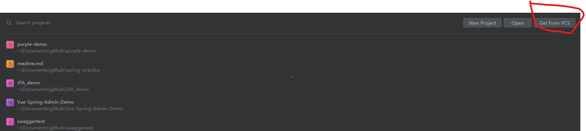

# Project Rebuild
1. clone project from Github

2. Once finish the clone process, right click the file "pom.xml" and then choose "maven" -> "Reload project"

3. After finish reloading project, open BackEndApplication.java file and run its main method. The application can start now.
